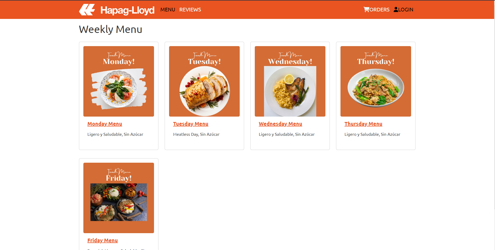
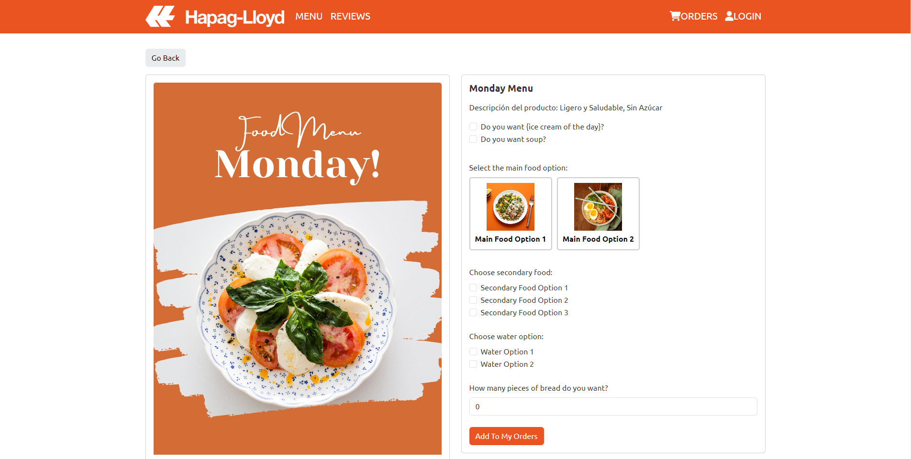

# Hapag-Lloyd FoodAppHG - Food Ordering Application

## Description
Hapag-Lloyd Café is a food ordering application designed for employees at the Mexico City site of Hapag-Lloyd AG. This application allows employees to conveniently place orders from the cafeteria, provides a clear view of inventory for the kitchen staff, and makes the cafeteria system more efficient, reducing food waste.

This app is designed to allow users to place food orders for the upcoming week. Users select the days on which they wish to order food, and each week, the kitchen staff updates the menu to offer different choices to users. Users can then select specific day's meals and add them to an e-commerce cart for ordering, after logging into their user account.

The final product of this project was developed using React.js, Django, REST Framework, GraphQL, and PostgreSQL. In this repository, I am only showcasing my Frontend Template (Test environment) used for the final version of the product. Please note that this is not the final version of the product (The license for the final product belongs to Hapag-Lloyd AG).

## Screenshots

_Main menu to select meals for the week._

_Menu to add the food that you want to order for the day._

## Installation
- Clone this repository.
- Run `npm install` to install the dependencies.
- Configure the necessary environment variables.
- Run `npm start` to start the application.

## Usage
- Browse the menu and select items.
- Place orders for the week.

## Technologies Used
- React
- Bootstrap
- Django (Final version, not available in the template)
- REST Framework (Final version, not available in the template)
- GraphQL
- PostgreSQL

## Contact
For questions or to connect, you can also visit [my LinkedIn profile](https://www.linkedin.com/in/miranda10am/).
